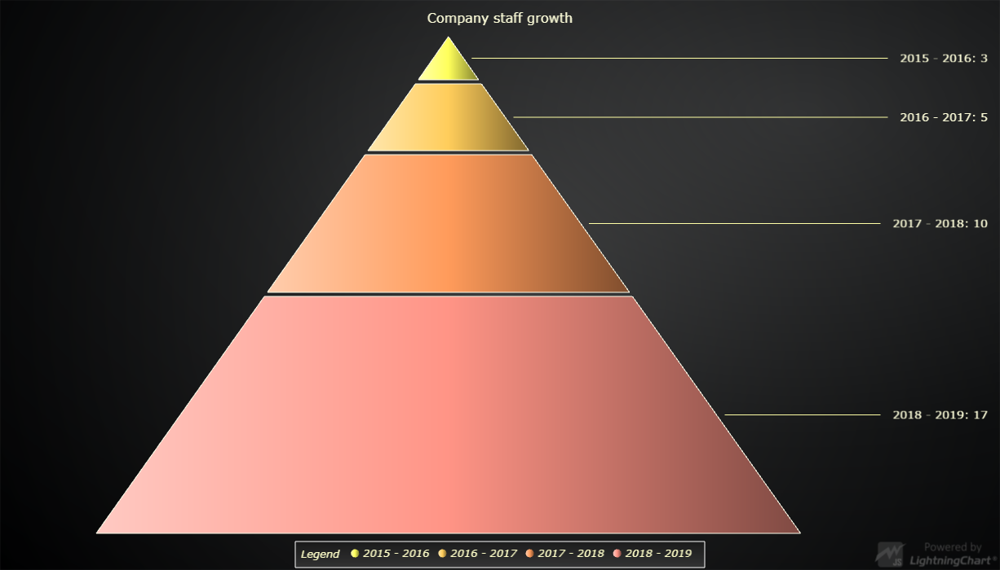

# Simple Pyramid Chart



This demo application belongs to the set of examples for LightningChart JS, data visualization library for JavaScript.

LightningChart JS is entirely GPU accelerated and performance optimized charting library for presenting massive amounts of data. It offers an easy way of creating sophisticated and interactive charts and adding them to your website or web application.

The demo can be used as an example or a seed project. Local execution requires the following steps:

- Make sure that relevant version of [Node.js](https://nodejs.org/en/download/) is installed
- Open the project folder in a terminal:

        npm install              # fetches dependencies
        npm start                # builds an application and starts the development server

- The application is available at *http://localhost:8080* in your browser, webpack-dev-server provides hot reload functionality.


## Description

Pyramid Chart is a chart used to show statistical graphic. The Pyramid chart is divided into slices, with each slice illustrating the numerical portion of the whole Pyramid. Each slice's size (usually depicted as the slice's relative height from the Pyramid) is proportional to its quantity.

The chart can be created with a simple line of code.

```javascript
// Create a new Pyramid Chart.
const pyramid = lightningChart().Pyramid()
```

The Pyramid Chart has two types for displaying the labels for each slice; The slices can be placed either on top of each slice by using the LabelsInsideSlices type, or they can be placed on both sides of the Chart by using LabelsOnSides type. The type must be given to the Chart as a parameter when creating it.
By default, the LabelsOnSides type is used.

```javascript
// Create a new Pyramid Chart and pass the type to use when placing labels.
const pyramid = lightningChart().Pyramid( { type: PyramidChartTypes.LabelsOnSides } )
```

After creating the Pyramid Chart, we can populate it by adding slices to it.
The slice should always get a name and value as parameters.

You can alternatively add multiple slices as an array of objects containing a name and a value for each slice.

```javascript
// Add a single slice to populate the Pyramid.
pyramid.addSlice( 'Planning', 100 )

// Add multiple slices to populate the Pyramid.
pyramid.addSlices([
    {
        name: 'Slice1', value: 45
    }, {
        name: 'Slice2', value: 83
    }, {
        name: 'Slice3', value: 19
    }
    ])

```

You can modify how the Pyramid and its slices are drawn through the Pyramid Chart's API.

```javascript
// Set the width of the Pyramid's bottom edge. This value can be from 0 to 100 (in percents).
pyramid.setNeckWidth( 80 )

// Set the gap between each of the slices. This value can be between 0 to 20 pixels.
pyramid.setSliceGap( 5 )

// If the labels are set to be placed on the side of the Pyramid,
// we can determine the side here as well.
pyramid.setLabelSide( PyramidLabelSide.Right )

```

The Slices can be styled using the Pyramid Chart's API.

```javascript
// Create a palette of Solid FillStyles to use with the Pyramid slices.
const palette = SolidFillPalette( ColorPalettes.warm, data.length )
// Set the palette used for coloring each of the slices.
pyramid.setSliceFillStyle( palette )

```

The labels for all slices can be formatted in different ways.

```javascript
// Set the label formatting to show the slice's name and the relative value
// (size of the slice as percentage).
pyramid.setLabelFormatter( SliceLabelFormatters.NamePlusRelativeValue )
```

The lines connecting each slice to its label can be modified.

```javascript
// Set the style used with all connector lines.
pyramid.setLabelConnectorStyle(
    new SolidLine({
        thickness: 3,
        fillStyle: new SolidFill(
            { color: ColorRGBA( 100, 150, 195 ) }
        )
    })
)
```


## API Links

* [Pyramid Chart]
* [Pyramid Chart Types]
* [Pyramid Label Side]
* [Slice label formatter]
* [Palette]
* [SolidFillPalette]
* [Solid Line]
* [Solid Fill]


## Support

If you notice an error in the example code, please open an issue on [GitHub][0] repository of the entire example.

Official [API documentation][1] can be found on [Arction][2] website.

If the docs and other materials do not solve your problem as well as implementation help is needed, ask on [StackOverflow][3] (tagged lightningchart).

If you think you found a bug in the LightningChart JavaScript library, please contact support@arction.com.

Direct developer email support can be purchased through a [Support Plan][4] or by contacting sales@arction.com.

[0]: https://github.com/Arction/
[1]: https://www.arction.com/lightningchart-js-api-documentation/
[2]: https://www.arction.com
[3]: https://stackoverflow.com/questions/tagged/lightningchart
[4]: https://www.arction.com/support-services/

© Arction Ltd 2009-2020. All rights reserved.


[Pyramid Chart]: https://www.arction.com/lightningchart-js-api-documentation/v2.1.0/classes/pyramidchart.html
[Pyramid Chart Types]: https://www.arction.com/lightningchart-js-api-documentation/v2.1.0/globals.html#pyramidcharttypes
[Pyramid Label Side]: https://www.arction.com/lightningchart-js-api-documentation/v2.1.0/enums/pyramidlabelside.html
[Slice label formatter]: https://www.arction.com/lightningchart-js-api-documentation/v2.1.0/globals.html#slicelabelformatter
[Palette]: https://www.arction.com/lightningchart-js-api-documentation/v2.1.0/globals.html#colorpalettes
[SolidFillPalette]: https://www.arction.com/lightningchart-js-api-documentation/v2.1.0/globals.html#solidfillpalette
[Solid Line]: https://www.arction.com/lightningchart-js-api-documentation/v2.1.0/classes/solidline.html
[Solid Fill]: https://www.arction.com/lightningchart-js-api-documentation/v2.1.0/classes/solidfill.html

